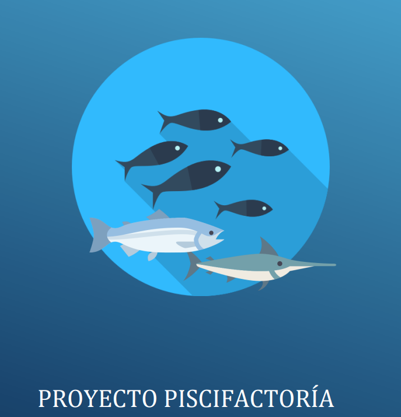

# Piscifactoría Simulador - Proyecto Completo

## Descripción del Proyecto

Este proyecto tiene como objetivo desarrollar un programa que simule una piscifactoría, incluyendo la gestión de peces, su ciclo de vida, alimentación, reproducción y la administración de las instalaciones. La idea base es crear un sistema robusto y modular que permita gestionar los diferentes aspectos de una piscifactoría, mejorando y ampliando el programa a medida que avanzan las entregas.



---

## Características principales

- **Simulación del ciclo de vida de los peces**: El sistema simula el crecimiento de los peces, su alimentación, reproducción y muerte.
- **Gestión de peces**: El programa permite gestionar las poblaciones de peces en la piscifactoría, incluyendo la capacidad máxima del tanque, las especies y la diferenciación entre machos y hembras.
- **Acceso a ficheros (XML y JSON)**: Se incluye funcionalidad para guardar y cargar el estado de la piscifactoría usando formatos de archivo como XML y JSON.
- **Acceso a bases de datos (MySQL)**: En la última ampliación, se incorporan funcionalidades para almacenar los datos de la piscifactoría en una base de datos MySQL.
- **Manejo de errores**: Durante cada entrega, se identifican y corrigen los posibles fallos para asegurar que las siguientes entregas funcionen correctamente.

---

## Estructura del Proyecto

### Clases principales

- **Simulador**: Controla el ciclo de vida de los peces, la alimentación, la reproducción y la gestión de las piscifactorías.
- **Piscifactoría**: Representa una piscifactoría donde se gestionan los peces, el tanque y las diferentes actividades relacionadas.
- **Peces**: Contiene la lógica de los peces, como su crecimiento, alimentación y reproducción.

### Acceso a archivos

- **XML**: Utilizado para almacenar la configuración básica de la piscifactoría.
- **JSON**: Se emplea para representar el estado de la piscifactoría en formato más accesible y flexible.
- **Base de datos MySQL**: Almacenamiento persistente para gestionar datos más complejos y acceder a ellos rápidamente.

### Ciclo de vida de los peces

- Los peces tienen un ciclo de vida simulado que incluye las etapas de crecimiento, madurez, reproducción, y muerte.
- Se pueden gestionar variables como la cantidad de peces adultos, alimentados, fértiles, entre otros.

---

## Instrucciones de uso

### Configuración Inicial

1. Clona este repositorio en tu máquina local usando el siguiente comando:

   ```bash
   git clone https://github.com/DavidTorresRial/ProyectoPiscifactoria.git
